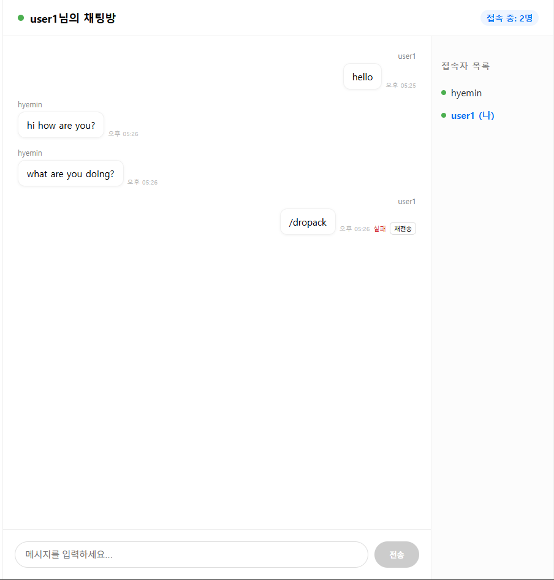

# Next.js Chat App



## Tech Stack

- Core: Next.js (App Router), React, TypeScript
- State: React Query, Recoil
- Styling: Emotion
- Package Manager: pnpm

## Purpose

이 프로젝트는 WebSocket 기반 채팅 기능을 직접 구현해보며,  
**프론트엔드와 Node.js 서버를 아우르는 실시간 통신 구조를 이해하기 위한** 스터디용 프로젝트입니다.

- Next.js(App Router) 환경에서의 클라이언트 중심 실시간 처리
- Node.js 기반 WebSocket 서버 구현
- WebSocket 기반 메시지 송수신 구조
- ACK 기반 메시지 전송 상태 관리
- 네트워크 불안정 상황에서의 재연결 UX 설계

---

## Features

- 닉네임 입력 후 채팅 참여
- 실시간 메시지 송수신
- 재접속 시 최근 메시지 히스토리 복원 (서버 메모리 기반)
- 메시지 전송 상태 관리 (`sending / sent / failed`)
- 실패 메시지 재전송
- WebSocket 연결 상태 관리 및 자동 재연결

---

## Message Flow

- 메시지 전송 시 optimistic UI로 즉시 `sending` 상태 추가
- 서버 ACK 수신 시 `sent`로 확정
- ACK 실패 시 `failed` 처리
- 서버 echo 중 **내 메시지는 필터링하여 중복 렌더링 방지**

---

## Run

```bash
pnpm install

# Next.js client
pnpm dev

# WebSocket server
pnpm dev:ws
```

## WebSocket 재연결 정책 (useChat)

### 상태 모델

- connectionStatus: `connected | reconnecting | disconnected`
  - connected: 정상 송수신 가능 (sendMessage 허용)
  - reconnecting: 자동 재연결 시도 중 (UI 노출 가능)
  - disconnected: 자동 재연결 실패/오프라인 등으로 완전 단절 (수동 재연결 필요)

### 자동 재연결 정책

- 트리거: WebSocket `onclose`
- 최대 자동 재시도 횟수: `MAX_RETRIES = 2`
- 재시도 지연: `RETRY_DELAYS = [0ms, 2000ms]`
  - 1차: 즉시 재시도(일시적 끊김/렉 대응)
  - 2차: 2초 대기 후 재시도(서버 재부팅/네트워크 복구 대기)
- 2회 모두 실패 시:
  - `connectionStatus = "disconnected"` 전환
  - UI에서 “다시 연결” 버튼 노출 후 `manualReconnect()`로 재시도

### 수동 재연결

- `manualReconnect()`:
  - retryCount 초기화 후 `connect()` 재호출

### 브라우저 네트워크 이벤트 처리

- `offline`:
  - 기존 ws가 있으면 close 후 `connectionStatus = "disconnected"`
- `online`:
  - 즉시 `connect()` 호출로 재연결 시도

### 메시지 전송 정책

- `sendMessage`는 `connectionStatus === "connected"`일 때만 전송
- ACK 타임아웃(3초) 내 ack 미수신 시 해당 메시지 status를 `failed`로 표시
- `retryMessage(clientId)`로 동일 clientMessageId로 재전송(중복 방지 목적)
